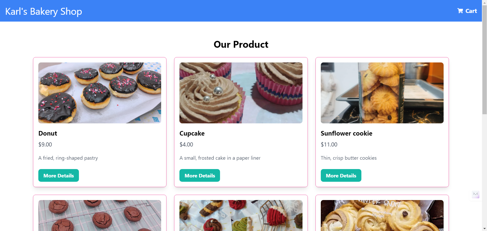

**Karl's Bakery Website**



**Database**

- Structure of the database:

Code:

```javascript
const createProductsTable = `
  CREATE TABLE IF NOT EXISTS products (
    productId SERIAL PRIMARY KEY,
    name TEXT NOT NULL,
    price INTEGER NOT NULL,
    image TEXT NOT NULL,
    shortDescription TEXT NOT NULL,
    longDescription TEXT NOT NULL
  );
`;

const createCartItemsTable = `
  CREATE TABLE IF NOT EXISTS cartItems (
    cartItemId SERIAL PRIMARY KEY,
    productId INTEGER REFERENCES products(productId),
    quantity INTEGER NOT NULL,
    totalPrice NUMERIC
  );
`;

const createOrdersTable = `
  CREATE TABLE IF NOT EXISTS orders (
    orderId SERIAL PRIMARY KEY,
    cartItemId INTEGER REFERENCES cartItems(cartItemId),
    name TEXT NOT NULL,
    creditCard TEXT NOT NULL,
    shippingAddress TEXT NOT NULL,
    sum NUMERIC NOT NULL
  );
`;
```
- Check db in docker using this cmd: ```docker exec -it karlsbakery-store-db-1 psql -U postgres -d mydb```

```bash
mydb=# \dt
           List of relations
 Schema |   Name    | Type  |  Owner
--------+-----------+-------+----------
 public | cartitems | table | postgres
 public | orders    | table | postgres
 public | products  | table | postgres
(3 rows)
```
-Databash diagram:

```bash
+-------------------+          +--------------------+          +--------------------+
|     products      |          |     cartItems       |          |      orders        |
+-------------------+          +--------------------+          +--------------------+
| productId (PK)    |<-------- | productId (FK)     |           | orderId (PK)       |
| name              |          | cartItemId (PK)    |<--------  | cartItemId (FK)    |
| price             |          | quantity           |           | name               |
| image             |          | totalPrice         |           | creditCard         |
| shortDescription  |          +--------------------+           | shippingAddress    |
| longDescription   |                                           | sum                |
+-------------------+                                           +--------------------+
                                                                
```
**API**

- Products:

```javascript
// Route to get all products
router.get('/', productsController.getAllProducts);

// Route to get product bt Id
router.get('/:productId', productsController.getProductById);

module.exports = router;
```

**Get request**

```bash
http get http://localhost:5000/api/products
HTTP/1.1 200 OK
Access-Control-Allow-Origin: *
Connection: keep-alive
Content-Length: 2841
Content-Type: application/json; charset=utf-8
Date: Tue, 15 Oct 2024 05:42:55 GMT
ETag: W/"b19-1aESUbicf+q/nIG8ksMjMGK6HZc"
Keep-Alive: timeout=5
X-Powered-By: Express

[
    {
        "image": "image/donut.png",
        "longdescription": "Sweet, fried pastries typically shaped like rings or filled with cream. They come in various flavors and toppings such as sugar glaze, sprinkles, and chocolate, offering a soft, fluffy texture",        
        "name": "Donut",
        "price": 9,
        "productid": 1,
        "shortdescription": "A fried, ring-shaped pastry"
    },
    {
        "image": "image/cupcake.png",
        "longdescription": "Individual-sized cakes baked in paper liners. They are frosted with buttercream, ganache, and decorated with sprinkles ",
        "name": "Cupcake",
        "price": 4,
        "productid": 3,
        "shortdescription": "A small, frosted cake in a paper liner"
    },
    {
        "image": "image/sunflowerCookie.png",
        "longdescription": "A delicate, crispy cookie with a light buttery flavor shaped like a sunflower with chocolate chips and almond toppings",
        "name": "Sunflower cookie",
        "price": 11,
        "productid": 2,
        "shortdescription": "Thin, crisp butter cookies"
    },
    {
        "image": "image/brownie.png",
        "longdescription": "Decadent dessert made with chocolate or cocoa, resulting in a dense, fudgy texture. You can order extra topping like nuts or chocolate chips",
        "name": "Brownie",
        "price": 5,
        "productid": 4,
        "shortdescription": "Fudgy matcha and chocolate brownie"
    },
    {
        "image": "image/christmasCookie.png",
        "longdescription": "Treats baked during the holiday season, shaped like flowers and Chrismas trees. They are decorated with colorful icing and sprinkles",
        "name": "Christmas cookie",
        "price": 4,
        "productid": 5,
        "shortdescription": "Festively decorated holiday cookies"
    },
    {
        "image": "image/marbleCookie.png",
        "longdescription": "Visually striking treats made by swirling vanilla and chocolate doughs together, creating a marbled effect. These cookies offer a delightful combination of two flavors in one bite, making them a popular choice for those who love both chocolate and vanilla",
        "name": "Marble cookie",
        "price": 4,
        "productid": 6,
        "shortdescription": "Swirled vanilla and chocolate cookie"
    },
    {
        "image": "image/chocoCookie.png",
        "longdescription": "Universally loved treat made from a buttery dough filled with chocolate chips.",
        "name": "Chocolate chip cookie",
        "price": 5,
        "productid": 7,
        "shortdescription": "A classic cookie with chocolate chips"
    },
    {
        "image": "image/eggTart.png",
        "longdescription": "A type of pastry filled with a smooth, sweet egg custard. Originating from Hong Kong and Macau, they feature a flaky, buttery crust that contrasts perfectly with the soft custard inside",
        "name": "Egg tart",
        "price": 5,
        "productid": 8,
        "shortdescription": "A creamy custard-filled pastry"
    },
    {
        "image": "image/chestCookie.png",
        "longdescription": "Cookies shaped like treasure chests and often contain a surprise filling, such as chocolate, fruit, or cream. Their unique appearance and hidden contents make them a fun and creative treat, perfect for special occasions",
        "name": "Chest cookie",
        "price": 4,
        "productid": 9,
        "shortdescription": "A chest-shaped cookie with a hidden filling"
    }
]
```
**GET by 1 Id request**

```bash
http get http://localhost:5000/api/products/1
HTTP/1.1 200 OK
Access-Control-Allow-Origin: *
Connection: keep-alive
Content-Length: 328
Content-Type: application/json; charset=utf-8
Date: Tue, 15 Oct 2024 05:44:58 GMT
ETag: W/"148-xtTvIcOCVA1Ll7JbZb/RFpibJug"
Keep-Alive: timeout=5
X-Powered-By: Express

{
    "image": "image/donut.png",
    "longdescription": "Sweet, fried pastries typically shaped like rings or filled with cream. They come in various flavors and toppings such as sugar glaze, sprinkles, and chocolate, offering a soft, fluffy texture",
    "name": "Donut",
    "price": 9,
    "productid": 1,
    "shortdescription": "A fried, ring-shaped pastry"
}
```

- Cart Route:

```javascript
// Route to get all cart items
router.get('/', cartController.getCartItems);

// Route to add an item to the cart
router.post('/add', cartController.addToCart);

router.delete('/delete', cartController.clearCart);
// Define the DELETE route to remove a cart item
router.delete('/:cartItemId', cartController.deleteCartItem);
```
**Get request**

```bash
http get http://localhost:5000/api/cart  
HTTP/1.1 200 OK
Access-Control-Allow-Origin: *
Connection: keep-alive
Content-Length: 86
Content-Type: application/json; charset=utf-8
Date: Tue, 15 Oct 2024 05:48:08 GMT
ETag: W/"56-utk2dPIksQKhfYzR/s9ApiC+BWg"
Keep-Alive: timeout=5
X-Powered-By: Express

[
    {
        "cartitemid": 1,
        "image": "image/cupcake.png",
        "name": "Cupcake",
        "price": 4,
        "quantity": 1
    }
]
```
**Post request**

```bash
http post http://localhost:5000/api/cart/add productId=1 quantity=3
HTTP/1.1 201 Created
Access-Control-Allow-Origin: *
Connection: keep-alive
Content-Length: 61
Content-Type: application/json; charset=utf-8
Date: Tue, 15 Oct 2024 05:51:38 GMT
ETag: W/"3d-J8KJP6PeNND35NDUip3fHHddCIg"
Keep-Alive: timeout=5
X-Powered-By: Express

{
    "cartitemid": 2,
    "productid": 1,
    "quantity": 3,
    "totalprice": "27"
}

- Order Route:

```javascript
// Route to create an order
router.post('/add', orderController.createOrder);

// Route to get order by ID
router.get('/:orderId', orderController.getOrderById);
```

**Delete request**

```bash
http delete http://localhost:5000/api/cart/delete
HTTP/1.1 200 OK
Access-Control-Allow-Origin: *
Connection: keep-alive
Content-Length: 26
Content-Type: application/json; charset=utf-8
Date: Tue, 15 Oct 2024 05:54:44 GMT
ETag: W/"1a-i0KbVIjnYMATZcf2ZX6d2KmG078"
Keep-Alive: timeout=5
X-Powered-By: Express

{
    "message": "Cart cleared"
}
```

- Order Route:

```javascript
// Route to create an order
router.post('/add', orderController.createOrder);

// Route to get order by ID
router.get('/:orderId', orderController.getOrderById);
```

**Post request**

```bash
http post http://localhost:5000/api/orders/add name="Karl" creditCard="12323232" shippingAddress="Mel" totalCost=32  
HTTP/1.1 201 Created
Access-Control-Allow-Origin: *
Connection: keep-alive
Content-Length: 104
Content-Type: application/json; charset=utf-8
Date: Tue, 15 Oct 2024 06:00:28 GMT
ETag: W/"68-AaOAAlMtHtfAhVmOoiF9fqorI0U"
Keep-Alive: timeout=5
X-Powered-By: Express

{
    "cartitemid": null,
    "creditcard": "12323232",
    "name": "Karl",
    "orderid": 1,
    "shippingaddress": "Mel",
    "sum": "32"
}
```

**Get request**

```bash
http get  http://localhost:5000/api/orders/1
HTTP/1.1 200 OK
Access-Control-Allow-Origin: *
Connection: keep-alive
Content-Length: 104
Content-Type: application/json; charset=utf-8
Date: Tue, 15 Oct 2024 06:03:09 GMT
ETag: W/"68-AaOAAlMtHtfAhVmOoiF9fqorI0U"
Keep-Alive: timeout=5
X-Powered-By: Express

{
    "cartitemid": null,
    "creditcard": "12323232",
    "name": "Karl",
    "orderid": 1,
    "shippingaddress": "Mel",
    "sum": "32"
}
```


